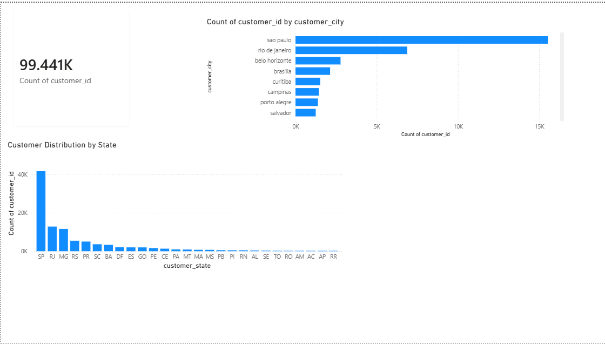
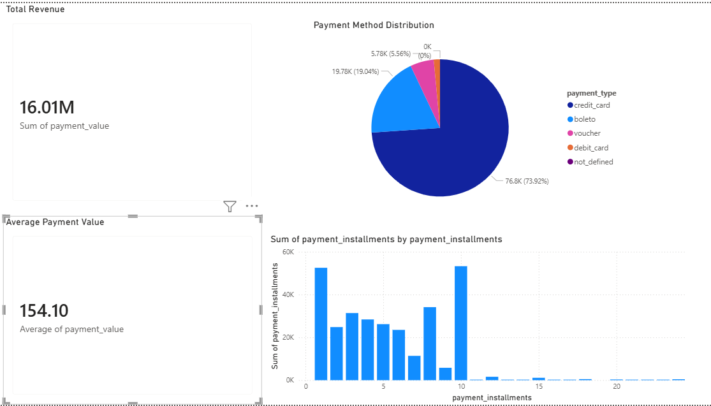

# AI-Powered E-Commerce Analytics System

## Project Overview

This is an end-to-end E-Commerce Analytics project built using Excel, SQL, Python, and Power BI.

The project analyzes:

* Orders Dataset
* Customers Dataset
* Payments Dataset
* Products Dataset

---

# Tools Used

* Excel
* PostgreSQL
* Python
* Pandas
* Matplotlib
* Power BI
* GitHub

---

# Features

* Order Analysis
* Customer Insights
* Payment Analytics
* Product Category Analysis
* Interactive Dashboards
* Business Intelligence Reporting

---

# SQL Analysis

* Total Orders
* Customer Distribution
* Payment Analysis
* Product Analytics

---

# Python Analysis

* Data Cleaning
* Pandas Analysis
* Data Visualization

---

# Power BI Dashboards

## Orders Dashboard


---

## Customers Dashboard



---

## Payments Dashboard



---

# Project Structure

```text
AI-Powered-Ecommerce-Analytics-System/
│
├── datasets/
├── excel/
├── python/
├── sql/
├── powerbi/
├── images/
└── README.md
```

---

# Business Insights

* Most orders are successfully delivered.
* São Paulo has the highest customer concentration.
* Credit cards are the most used payment method.
* Monthly order trends help understand seasonal demand.

---

# Author

## Jagruthi Uppala

B.Tech CSE (AI & ML)
Aspiring Data Analyst | Python | SQL | Power BI | Excel
